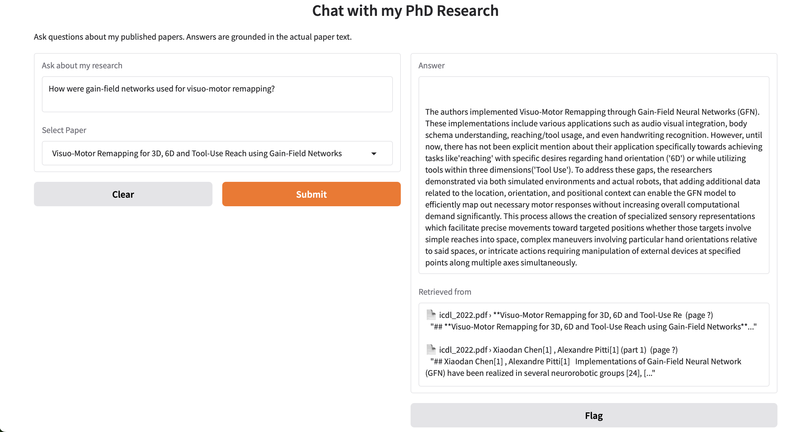
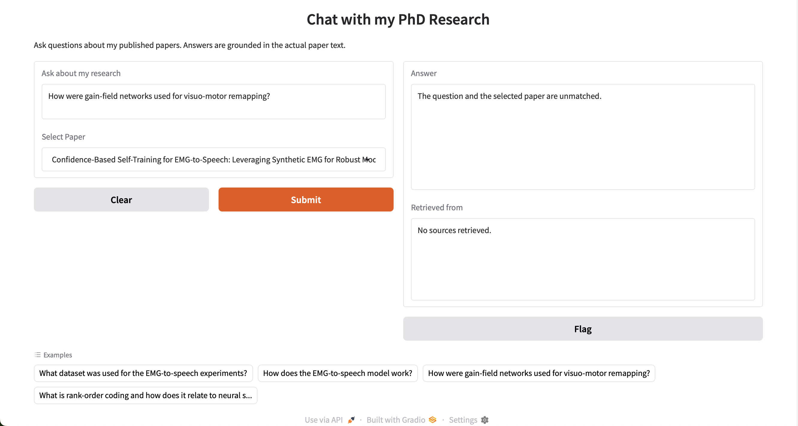

# Demo: My Thesis Chat — Chat with My PhD Research

A Retrieval-Augmented Generation (RAG) system that lets you ask natural language questions about my published research papers. Answers are grounded exclusively in the actual paper text — no hallucination, no general knowledge.

---

## What it does

You ask a question. The system finds the most relevant passages from my papers, feeds them to a local LLM, and returns a grounded answer with the source excerpt shown alongside it.


---

## Papers indexed

| Year | Paper | Venue |
|------|-------|-------|
| 2026 | Structure from Rank: Rank-Order Coding as a Bridge from Sequence to Structure | Neural Networks (Journal) |
| 2025 | Closing the Data Gap in EMG-to-Speech | IEEE ASRU 2025 |
| 2024 | Developmental Predictive Coding Model for Early Infancy Mono and Bilingual Vocal Continual Learning | International Conference on Artificial Neural Networks (ICANN) 2024 |
| 2022 | Visuo-Motor Remapping for 3D, 6D and Tool-Use Reach using Gain-Field Networks | IEEE International Conference on Development and Learning (ICDL) conference 2022 |

---

## Architecture

```
PDF papers
    ↓  pymupdf4llm  (column-aware markdown extraction)
Clean markdown  (references removed, tables converted)
    ↓  MarkdownHeaderTextSplitter + RecursiveCharacterTextSplitter
Chunks  (~270 chunks, ~1000 chars each, split by section)
    ↓  sentence-transformers/all-MiniLM-L6-v2
384-dim vectors
    ↓  FAISS index  (saved to disk)
    
At query time:
Question → embed → FAISS MMR search → top-5 chunks
→ Phi-3-mini-4k-instruct (4-bit quantized, 2.4 GB VRAM)
→ Grounded answer + source display
```

**Key design decisions:**
- `pymupdf4llm` handles double-column academic PDF layout correctly
- References sections are removed before chunking to avoid bibliography noise
- MMR (Maximal Marginal Relevance) retrieval ensures diverse chunks rather than near-duplicates
- Per-paper filtering lets the UI restrict retrieval to one paper at a time


---

## Requirements

### Hardware
- GPU with 8+ GB VRAM (tested on NVIDIA Quadro RTX 8000 48 GB)
- 16+ GB system RAM
- 10+ GB disk space for model weights

### Software
- Python 3.11
- CUDA 12.1+
- See `environment.yml` for full Python dependencies

---

## Installation

```bash
# 1. Clone the repository
git clone https://github.com/XiaodanChenSheldan/MyThesisChatDemo.git
cd demo

# 2. Create conda environment
conda create -n rag-demo python=3.11 -y
conda activate rag-demo

# 3. Install PyTorch with CUDA
pip install torch==2.2.0 torchvision==0.17.0 \
    --index-url https://download.pytorch.org/whl/cu121

# 4. Install all dependencies
conda env create -f environment.yml

# 5. Set HuggingFace cache location (important on shared servers)
export HF_HOME=/path/to/large/partition/hf_cache
echo 'export HF_HOME=/path/to/large/partition/hf_cache' >> ~/.bashrc
```

---

## Usage

### Step 1 — Add your PDFs

```bash
mkdir -p data/
# Copy your PDF papers into data/
cp /path/to/your/papers/*.pdf data/
```

### Step 2 — Build the index

Run once. Downloads the embedding model (~90 MB) and builds the FAISS index.

```bash
python ingest.py
```

Expected output:
```
=== STAGE 1: Extracting markdown from PDFs ===
  Processing: icann_2024.pdf
    → Raw markdown: 44298 chars
    → Clean markdown: 38012 chars
...
Total chunks across all papers: 270
Average chunk size: 630 chars
...
=== INGESTION COMPLETE ===
```

### Step 3 — Launch the app

Downloads Phi-3-mini (~5 GB, first run only) and starts the Gradio UI.

```bash
python app.py
```

Open your browser at `http://localhost:7860`


---

## Project structure

```
paperpilot/
├── data/                          ← PDF papers (not tracked by git)
│   ├── neural_networks_2026.pdf
│   ├── emg_speech_2025.pdf
│   ├── icann_2024.pdf
│   └── icdl_2022.pdf
├── faiss_index/                   ← built by ingest.py (not tracked by git)
│   ├── index.faiss
│   └── index.pkl
├── flagged/                       ← Gradio flagging output
├── ingest.py                      ← PDF → chunks → FAISS index
├── app.py                         ← RAG chain + Gradio UI
├── environment.yml
└── README.md
```

---

## How it works — technical details

### PDF extraction (`ingest.py`)

Academic papers present two challenges for text extraction:

1. **Double-column layout** — naive parsers interleave left and right column content line by line. `pymupdf4llm` uses layout analysis to extract each column separately, producing clean prose.

2. **Reference noise** — bibliography sections contain many mentions of paper titles and author names, causing them to score highly for almost any research query. References are removed by detecting the `References` section header before chunking.


### Chunking strategy

Two-pass splitting:
1. **Header-level split** — `MarkdownHeaderTextSplitter` first splits on `#`, `##`, `###` headers so each chunk corresponds to one named section (Introduction, Methods, Results...).
2. **Size split** — sections longer than 1000 chars are further split by `RecursiveCharacterTextSplitter` with 500-char overlap.

This means every chunk knows which section of which paper it comes from — visible in the UI as `icann_2024.pdf › 4.3 Results`.

### Retrieval

FAISS flat index with MMR (Maximal Marginal Relevance) search. MMR balances:
- **Relevance** — how similar the chunk is to the query
- **Diversity** — avoids returning 5 chunks from the same paragraph

Configured with `k=2, fetch_k=10, lambda_mult=0.7`.

Per-paper filtering is supported — the UI dropdown restricts retrieval to one paper, which improves precision for paper-specific questions.

### LLM

`microsoft/Phi-3-mini-4k-instruct` loaded in 4-bit NF4 quantization via `bitsandbytes`:
- Full model: ~15 GB in float32
- Quantized: ~2.4 GB VRAM
- Quality loss: minimal for extractive Q&A tasks

The prompt template uses Phi-3's native `<|system|>` / `<|user|>` / `<|assistant|>` chat format and explicitly seeds the answer with `"Based on the provided excerpts:"` to anchor generation to the retrieved context.

---

## Limitations

- **Retrieval quality depends on chunk coverage** — if a key paragraph was split at a boundary, retrieval may miss it. Increasing `chunk_overlap` helps.
- **Phi-3-mini occasionally hallucinates** on vague cross-paper questions. Paper-specific questions (using the dropdown) are more reliable.
- **No conversation memory** — each question is independent. The system does not remember previous questions in the same session.
- **English only** — the embedding model and LLM are optimized for English. French or Chinese queries will work but with degraded retrieval quality.

---

## Skills demonstrated

This project was built to demonstrate practical competence with the modern LLM/RAG stack:

| Skill | Where used |
|-------|-----------|
| HuggingFace ecosystem | `transformers`, `peft`, `sentence-transformers`, model hub |
| RAG patterns | FAISS vector store, MMR retrieval, chunk strategy |
| LangChain orchestration | `RetrievalQA`, `PromptTemplate`, retriever filters |
| Prompt engineering | Phi-3 chat template, grounding constraints, answer seeding |
| 4-bit quantization | `BitsAndBytesConfig`, NF4, double quantization |
| PDF parsing | `pymupdf4llm`, column-aware extraction, reference removal |
| Gradio UI | Per-paper dropdown, source display, example questions |

---

## Example


If the question and the selected paper do not match, no answer will be returned.


## Author

**Xiaodan Chen** — PhD in Computer Science, AI & Machine Learning  
CY Cergy Paris University / A*STAR Singapore / CNRS IPAL  
[GitHub](https://github.com/XiaodanChenSheldan)

---

## License

MIT License — see `LICENSE` for details.